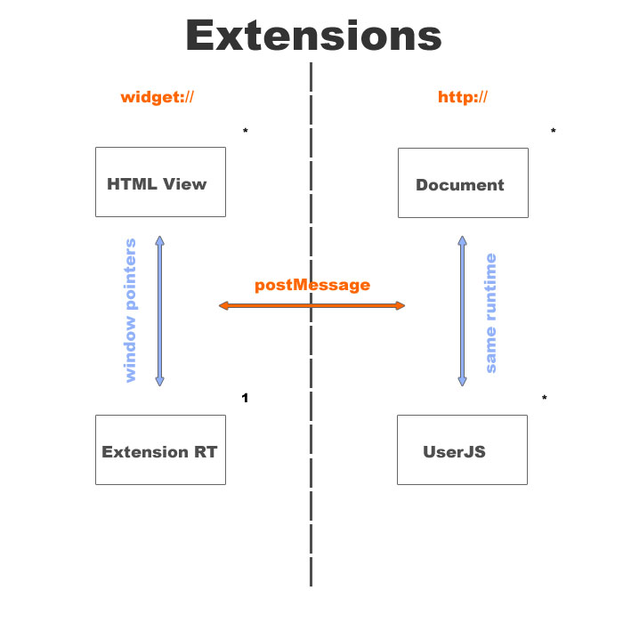

========================
Dragonfly and extensions
========================

:status: suggestion

Some suggestions and thoughts about Dragonfly and extensions.

Terms 
=====

( as suggestions, not sure if there are already established ones )

:host: the Opera instance to be debugged

:client: the Opera instance acting as debugger

:debug-context: the window or tab to be debugged, including any type of frame-window and any other window or tab opened by that window ( including any tab or window which has the opener property pointing to an other window in the debug context )

:debug-context-select: the drop down to select the window or tab to be debugged

:remote-debug: a debugging session with two separate Opera instances

:home-debug: a debugging session within the same Opera instance, e.g. the common use-case on desktop 

:extension-runtime: a runtime without any visible document

:tool-strip: a type of HTML view, a small button-like html window in any tool-bar ( like Chrome extensions )

:extension-chrome-window: a type of HTML view, bound to the main chrome window. can be a free floating window or attached to the main chrome window as panel in top, right, bottom or left position

:extension-tab-window: a type of HTML view, bound to the tab window ( like e.g. the address bar ). can be a free floating window or attached to the tab window as panel in top, right, bottom or left position. dies together with the tab, independent of the current position.

From the user perspective
=========================

( only in regard of extension design )

If the extension is installed it will display a small Dragonfly button. The button will change if the active window has any kind of error, perhaps it will show the number of errors ( html, css, js ) of the active tab. 

The Dragonfly window can be opened in several ways:
- from a menu entry "Developer Tools"
- from the right click menu "Inspect Element"
- by clicking the Dragonfly button

The Dragonfly window opens as extension-tab-window. It has two modes, remote-debug and home-debug. 

In home-debug mode the Dragonfly window is always bound to the tab and there will be no debug-context-select, no matter if it is attached or free floating. ( Widgets need to be discussed separately, they have basically a own instance, but currently the plan is to have a special debug mode for them ). Any existing tab or window can have it's own Dragonfly window in home-debug mode, that means there can be any number of Dragonfly windows in home-debug mode.

In remote-debug mode it will show always a debug-context-select to select one of the windows, tabs or widgets of the host. It is only possible to have one single Dragonfly window in remote-debug mode, opening a new remote-debug window or converting an existing to remote-debug in the settings tab will fail.

The main change here in regard of what we have discussed so far is to drop the debug-context-select in home-debug mode with the detached Dragonfly window. IMO that does simplify the user interaction quite a lot and is basically easier to understand. It also reduces the issue with state loss and Dragonfly quite a lot. Only remote-debug mode can have a debug-context-select and such a window can exist only once ( per Opera instance ).

Some technical thoughts
=======================

I assume that the extension API is defined somewhere ( also i haven't seen it so far ), so this are only thoughts about Dragonfly specific issues. Basically i see the following main issues:

- get the internal object-id
- make the window filter service aware
- create a logic to separate the different Dragonfly windows according to there debug-context

The extension will have to be able to identify in some way windows in terms of ui windows to e.g. attach an extension-tab-window to a given tab. It would nice if that identifier could be the same as we are already using in scope in e.g. the window-manager service as window-id of a given window ( not to be confused with the top runtime-id of a given window ).

The internal object ID
----------------------

For  Dragonfly the user-js of the extension will need to have some method to get the internal object-id used in scope, e.g. something like:

.. code-block:: javascript

  interface Opera {
    id scopeGetId(in Object object)
  }

Such a  method will e.g. be needed to identify the right-clicked element in terms of scope ids.

Window filter per service
-------------------------

The Dragonfly button tool-strip should e.g. be able to only enable the console-logger service for any window ( and update its info according to the errors of the active window ).

An actual Dragonfly window instead should enable most services but only for the according window. 

That means the window filter should take a service argument in some way so tat this two use cases could be addressed.

Logic to separate the Dragonfly windows
---------------------------------------

My suggestion would be to address this issue with the scopeAddClient method by extending it like:

.. function:: scopeAddClient(connected: callback, receive: callback, quit: callback, port: number[, ui_window: ui_window_id])

`ui_window_id` would be the identifier for a given window or tab in terms of the extension API ( ideally the same id as e.g. in the window-manager service ). It is an optional argument and has only an effect if the port number is zero, that means only for home-debug mode. If port number is zero then it would be the debug-context. The window-manager service would be removed from the service list, that means such a client has no access to the window-manager service, it would only get messages for the given debug context, no matter if the actual window is attached or detached. It would also change the behavior so that the call would not re-create the client but only add a 'pseudo' client to an already existing client by re-adjusting the window filter.

Related to this i could be interesting to move the context of a message ( window-id and document-id ) to the head of a STP/1 message.

